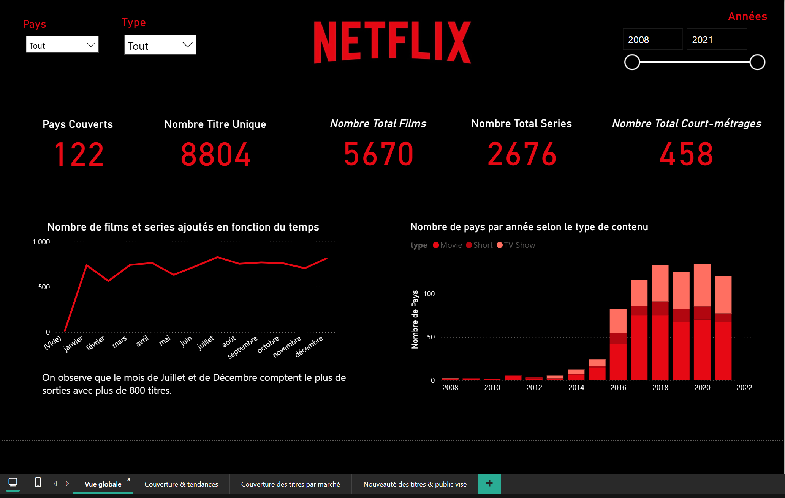
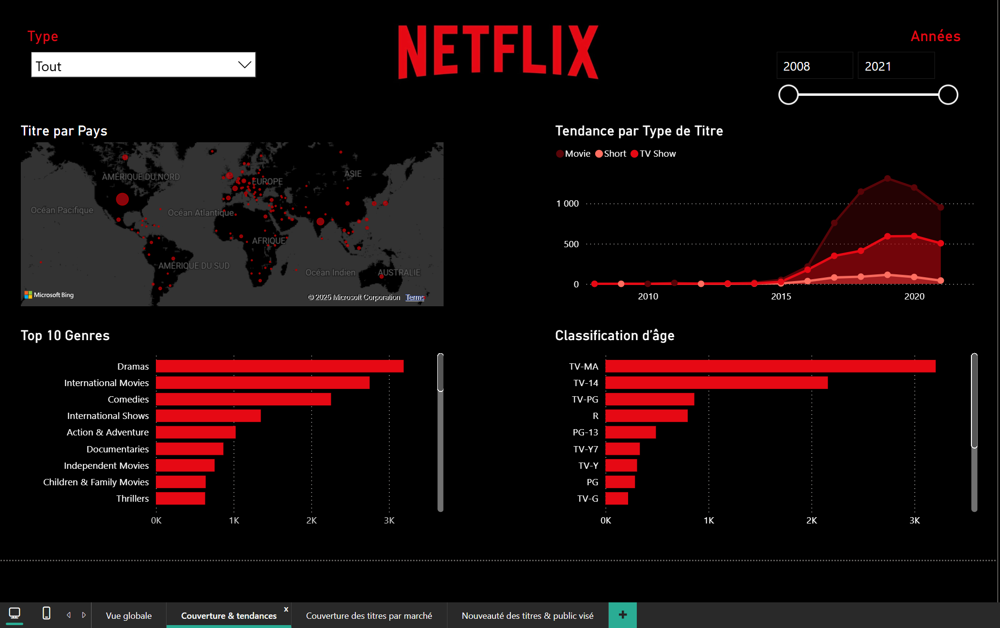
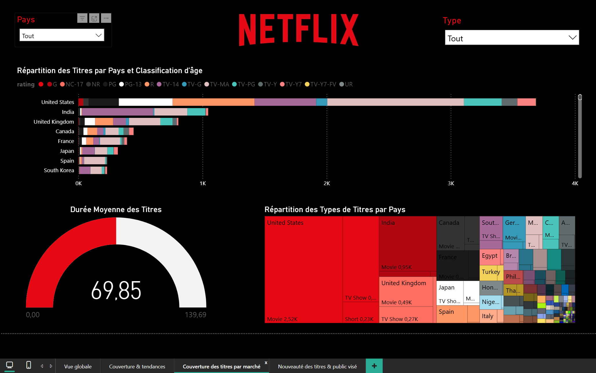
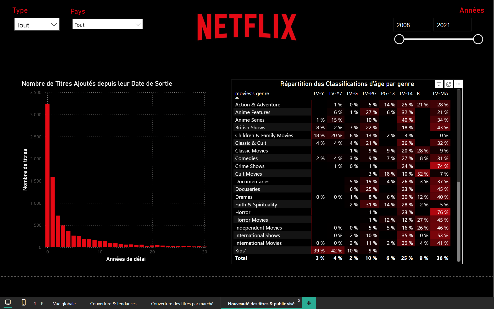
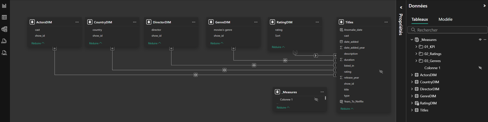

# Netflix — Power BI Dashboard

Analyse du catalogue Netflix par **pays**, **types**, **genres** et **classements d’âge** (2008–2021) avec Power BI.

## Aperçus
  
 

## Modèle de données

## Points clés
- Table centrale **`Titles`** reliée à **ActorsDIM, CountryDIM, DirectorDIM, GenreDIM, RatingDIM**
- Mesures rangées dans **_Measures** : `01_KPI`, `02_Ratings`, `03_Genres`
- Mesure phare : **Share_Rating_in_Genre** (répartition des classifications d’âge au sein de chaque genre)

## Fichiers
- **Netflix_PowerBI.pbix** — ouvrir avec *Power BI Desktop*
- **assets/** — captures d’écran et schéma du modèle

---

*Power BI · DAX · Data Modeling*
